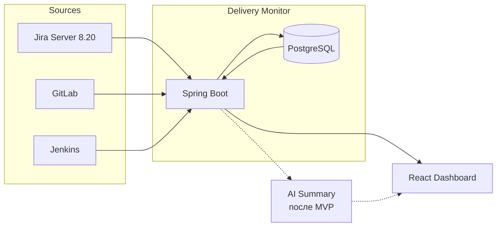
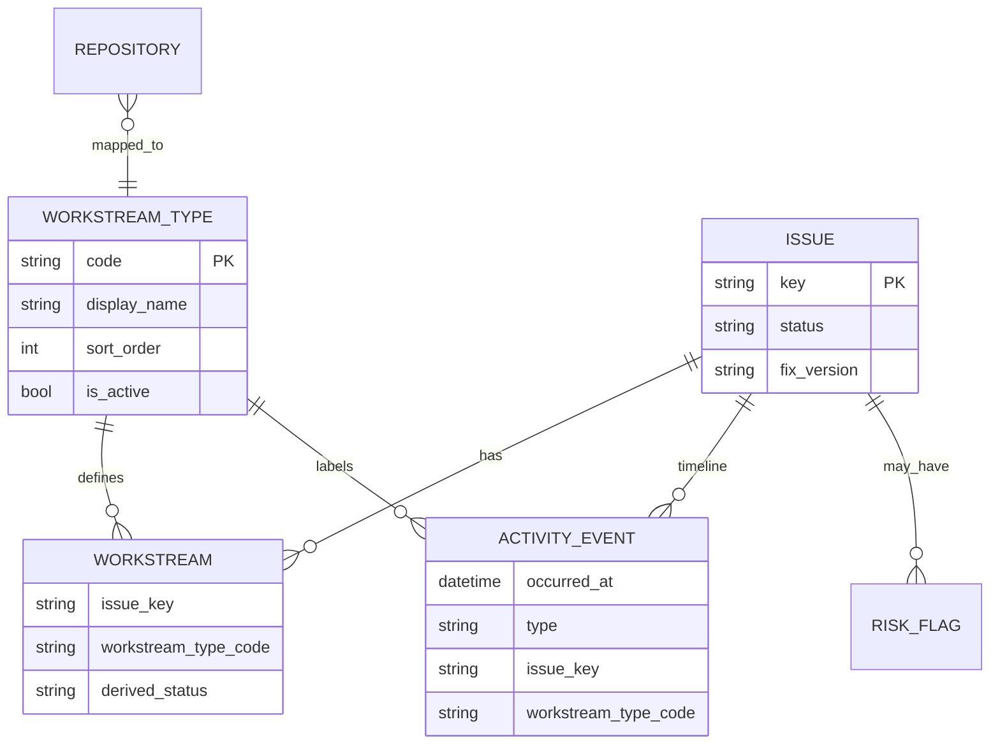
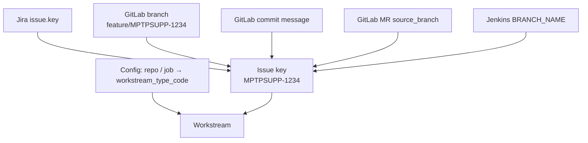
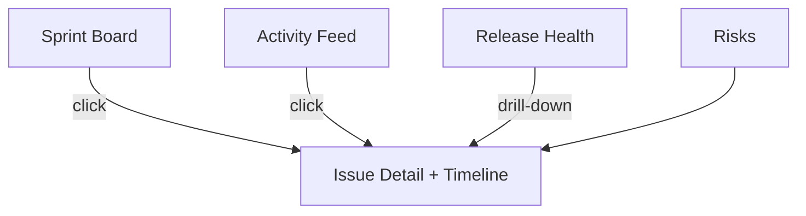
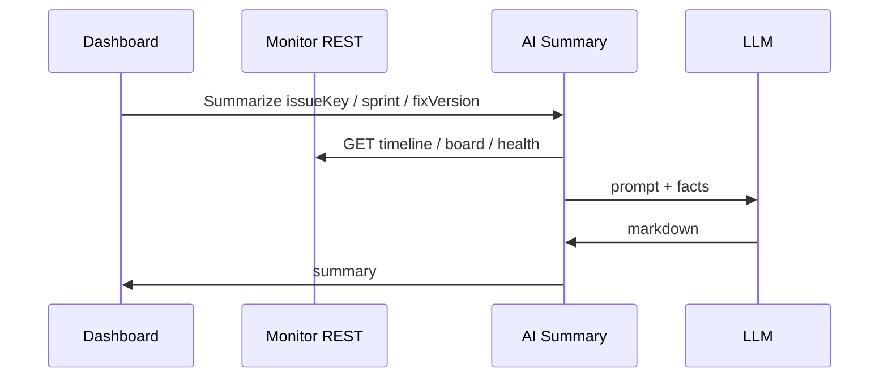
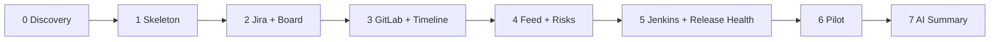

# AI Engineering Delivery Monitor — Architecture Design

| | |
|---|---|
| **Status** | Accepted |
| **Version** | 2.1 |
| **Team** | 9 человек: 7 разработчиков + 2 QA |
| **Purpose** | Единый shareable-документ (эквивалент Cursor Canvas). Можно пересылать целиком |

Рендер Mermaid: GitLab / GitHub / VS Code (Markdown Preview Mermaid) / Notion / Confluence.

**Теги:** Spring Boot monolith · PostgreSQL · Scheduler + REST · Timeline-first · Configurable Workstream Type · AI — отдельный сервис

> **Source of truth по деталям модулей** по-прежнему разбит в `docs/*.md`.  
> Этот файл — **единая сводка для передачи** (то, что раньше смотрели в canvas).

---

## Что изменилось относительно v1

Убраны: CQRS-lite, RabbitMQ / Redis Streams, Redis, GraphQL, Notification Service, People-экран из MVP.

Добавлены: Timeline как главный UX, Activity Feed, Release Health.

AI — отдельный сервис поверх API, не часть backend.

---

## Workstream Type

Система **не** знает про Backend / Frontend / Android / Oracle как про захардкоженные платформы.

Она знает только **Workstream Type**: конфигурируемый справочник (`code`, `display_name`, `sort_order`, `is_active`).

Текущий seed команды (данные, не код домена):

```yaml
workstream_types:
  - { code: backend,  display_name: Backend,  sort_order: 1 }
  - { code: frontend, display_name: Frontend, sort_order: 2 }
  - { code: oracle,   display_name: Oracle,   sort_order: 3 }
  - { code: qa,       display_name: QA,       sort_order: 4 }
```

Завтра можно добавить `ios` / `analytics` без изменения кода домена.

---

## 1. Архитектура



### Стек MVP

| Layer | Choice |
|---|---|
| Backend | Spring Boot (один сервис) |
| DB | PostgreSQL |
| Ingest | `@Scheduled` + optional webhooks → сразу в БД |
| API | REST |
| UI | React |
| AI | Отдельный сервис (после MVP) |

### Поток данных

1. Scheduler тянет Jira / GitLab / Jenkins  
2. Webhook (если есть) пишет сразу в БД  
3. Сервис нормализует и линкует по **issue key**  
4. REST отдаёт данные экранам  
5. AI читает тот же REST — не трогает БД  

### Почему не CQRS / очереди / Redis

Объём событий для одной команды — сотни/тысячи в день, не миллионы.  
`Scheduler → REST → DB` покрывает latency «минуты». Сложность откладываем до реальной боли.

---

## 2. Backend-модули (пакеты monolith)

| Пакет | Ответственность | MVP |
|---|---|---|
| `integration.jira` | Poll sprint / issues / changelog / comments / links | Да |
| `integration.gitlab` | Poll/webhook: branches, commits, MR, notes | Да |
| `integration.jenkins` | Poll/webhook: builds | Да |
| `domain.issue` | Issue + sprint + fixVersion | Да |
| `domain.workstream` | Workstream = issue × Workstream Type | Да |
| `domain.workstream_type` | Справочник типов (config/data) | Да |
| `domain.timeline` | Поток событий по задаче | Да |
| `domain.activity` | Командный activity feed | Да |
| `domain.release` | Release Health по fixVersion | Да |
| `domain.risk` | Правила рисков | Да |
| `api` | REST controllers | Да |
| AI Summary (отдельный сервис) | REST → LLM → markdown | После MVP |

---

## 3. Схема БД (логическая)



| Таблица | Ключевые поля | Зачем |
|---|---|---|
| `people` | id, name, jira_user, gitlab_user, role | Маппинг личностей |
| `sprints` | jira_id, name, start, end, state | Контекст спринта |
| `issues` | key, summary, status, assignee_id, sprint_id, fix_version | Якорь |
| `workstream_types` | code PK, display_name, sort_order, is_active | Типы потоков |
| `workstreams` | issue_id, workstream_type_code, owner_id, derived_status | issue × type |
| `repositories` | gitlab_project_id UK, path, name, workstream_type_code | Repo → type (match by id, not path) |
| `branches` / `commits` / `merge_requests` / `builds` | … + issue_key | Сырьё |
| `activity_events` | occurred_at, issue_key, workstream_type_code, actor_id, type, payload | Timeline + Feed |
| `dependencies` | from_ws, to_ws, type, source | Блокеры |
| `risk_flags` | issue_id, code, severity, open | Риски |
| `sync_state` | source, last_sync_at, cursor | Watermark scheduler |

**`activity_events` — сердце продукта:** один факт пишется один раз.  
Timeline = filter by issue. Feed = order by time. Release Health = агрегация workstreams × type для fixVersion.

### Типы activity_events (MVP)

| type | Источник | Пример |
|---|---|---|
| `BRANCH_CREATED` | GitLab | `{type}` создал `feature/MPTPSUPP-123` |
| `COMMIT` | GitLab | commit в repo данного type |
| `MR_OPENED` | GitLab | MR !42 |
| `MR_APPROVED` | GitLab | Review approved |
| `MR_MERGED` | GitLab | Merged to main |
| `BUILD_STARTED` / `BUILD_FINISHED` | Jenkins | SUCCESS / FAILURE |
| `JIRA_STATUS` | Jira | In Progress → In Review |
| `JIRA_COMMENT` | Jira | Комментарий (автор, snippet) |
| `WORKSTREAM_STARTED` | Jira / inferred | Активность по типу (напр. `qa`) |
| `BLOCKER_ADDED` | Jira link | blocks MPTPSUPP-99 |

---

## 4. Интеграции



| Источник | Режим | Что тянем |
|---|---|---|
| **Jira Server 8.20** (`jira.eltc.ru`) | Poll 2–5 мин (primary); webhook опционально | Sprint, issues, changelog, **comments**, links |
| **GitLab** | Webhook preferred + reconcile 15–30 мин | Branches, commits, MR; repo → `workstream_type_code` |
| **Jenkins** | Webhook или poll jobs | Builds; branch → issue key |

```java
@Scheduled(fixedDelay = 180_000)
void syncJira() { /* upsert issues + JIRA_STATUS + JIRA_COMMENT */ }

@PostMapping("/hooks/gitlab")
void gitlab(@RequestBody payload) { /* write events */ }

@PostMapping("/hooks/jenkins")
void jenkins(@RequestBody payload) { /* write builds */ }
```

---

## 5. MVP — экраны

| Экран | Зачем | Приоритет |
|---|---|---|
| Sprint Board | Задачи + workstreams + risk badges | P0 |
| Issue Detail + Timeline | Хронология по Workstream Type | P0 — фича |
| Activity Feed | Лента команды как GitHub | P0 |
| Release Health | `%` по каждому Workstream Type для fixVersion | P0 |
| Risks | Вкладка/фильтр на Board | P1 |
| People / WIP | После пилота | Позже |
| AI Summary | Отдельный сервис | После MVP |



### Issue Timeline — главный UX

```text
MPTPSUPP-1234

09:15  backend   BRANCH_CREATED   feature/MPTPSUPP-1234
11:20  backend   COMMIT           API endpoint
12:05  oracle    COMMIT           package body
13:40  frontend  COMMIT           UI form
14:10  —         JIRA_COMMENT     «нужен контракт API»
14:30  backend   MR_OPENED        !88
16:00  —         BUILD_FINISHED   Jenkins #412 SUCCESS
```

Подписи типов — из `workstream_types`, не из кода UI.

### Release Health

```text
fixVersion 5.7.27
backend    90%
frontend   70%
oracle    100%
qa         20%
```

Строки = `SELECT … FROM workstream_types WHERE is_active`.  
Формула MVP: доля workstreams типа в статусе `merged` / `build_ok` / `done` среди issues с данным fixVersion.

---

## 6. AI — отдельный сервис



Почему не в backend: смена GPT/Claude/Grok без релиза Monitor; dashboard живёт на фактах без LLM.

---

## 7. Что сознательно НЕ делаем сейчас

| Идея | Почему отложено |
|---|---|
| CQRS / event sourcing | Нет объёма на две модели |
| RabbitMQ / Redis Streams | Webhook → DB достаточно |
| Redis cache | Postgres + poll хватает |
| GraphQL | 4 экрана — REST проще |
| Notification Service | Не проблема №1 |
| People экран | Боль про задачи и релиз |
| AI в monolith | Связывает с вендором LLM |

---

## 8. Риски

| Риск | Митигация |
|---|---|
| Кривой naming веток | Regex + orphan report; soft-link по MR title |
| Репозиторий без Workstream Type | Обязательный map repo → type; orphan report |
| Шум inferred-блокеров | Explicit Jira links vs soft inferred |
| Медленный Jira poll | Инкремент по `updated` |
| Пустой Timeline | Jira transitions (+ comments) с этапа 2 |
| Release % врёт | Прозрачная формула + drill-down |

---

## 9. Порядок реализации



| Этап | Срок | Результат |
|---|---|---|
| 0. Discovery | 3–5 дн | Workstream Types seed, repo→type, jobs, naming, доступы |
| 1. Skeleton | 3–5 дн | Spring Boot + Postgres + auth + пустой UI |
| 2. Jira + Board | ~1 нед | Sprint Board + `JIRA_STATUS` / `JIRA_COMMENT` в events |
| 3. GitLab + Timeline | 1.5–2 нед | Workstreams + Issue Timeline (**первая ценность**) |
| 4. Activity Feed + Risks | 3–5 дн | Лента + badges |
| 5. Jenkins + Release Health | ~1 нед | Builds + % по типам |
| 6. Pilot | 2 спринта | Shadow mode рядом с Jira |
| 7. AI Summary | после | Отдельный сервис |

---

## 10. REST MVP (черновик)

```
GET  /api/workstream-types
GET  /api/sprints/current
GET  /api/sprints/{id}/board
GET  /api/issues/{key}
GET  /api/issues/{key}/timeline
GET  /api/activity?since=…
GET  /api/releases/{fixVersion}/health
GET  /api/risks?sprintId=…
POST /hooks/gitlab
POST /hooks/jenkins
```

---

## Детальные документы (при необходимости)

| Файл | Содержание |
|---|---|
| [ai_context.md](./ai_context.md) | Точка входа для AI |
| [session_log.md](./session_log.md) | Журнал этапов |
| [vision.md](./vision.md) | Цель и принципы |
| [architecture.md](./architecture.md) | Архитектура (развёрнуто) |
| [database.md](./database.md) | Схема БД |
| [api.md](./api.md) | REST-контракт |
| [integrations.md](./integrations.md) | Jira / GitLab / Jenkins |
| [ux.md](./ux.md) | Экраны |
| [roadmap.md](./roadmap.md) | План |
| [decisions.md](./decisions.md) / [adr/](./adr/) | ADR |
| [glossary.md](./glossary.md) | Термины |
| [changelog.md](./changelog.md) | История |
| [structure.md](./structure.md) | Структура репо |

Cursor Canvas — только локальный обзор в IDE, **не** source of truth.
